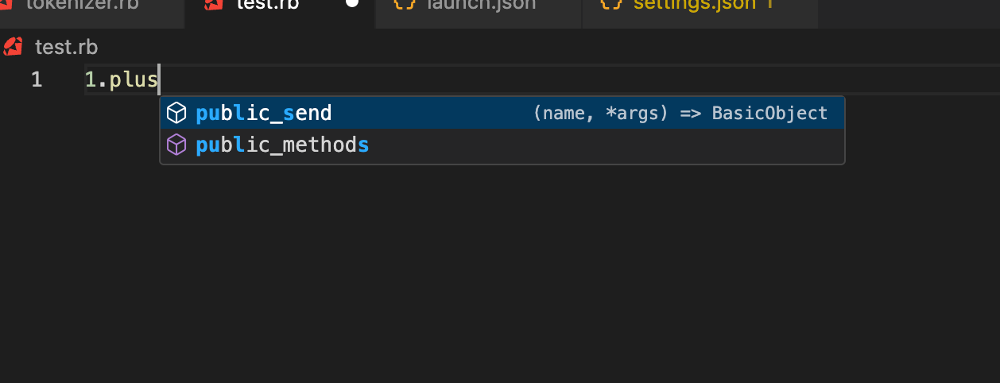
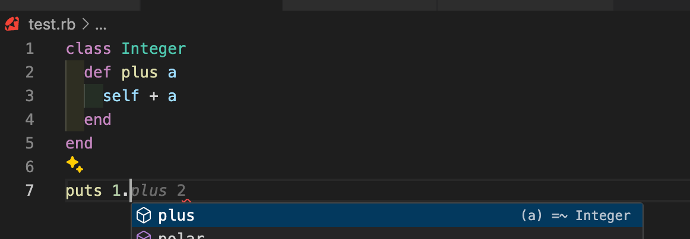

## 소개 

이 문서는 Ruby를 공부하면서 정리한 문서입니다. Ruby On Rails에 대한 문서를 보고 싶다면 아래 링크를 참고해주세요.

- https://github.com/rookedsysc/ruby-on-railgun/tree/main/ror-docs


## 루비

- Yukihiro Matz가 평소 좋아하던 Perl, Smalltalk, Eiffel, Ada, Lisp 등의 언어를 참고하여 함수형 프로그래밍과 명령형 프로그래밍의 균형을 맞춘 새로운 언어
- Matz - "Perl보다 강력하고 Python보다 더 객체 지향적인 스크립팅 언어를 원했습니다"
- Ruby에서는 모든 것이 객체이며, 모든 정보와 코드에는 고유한 속성과 작업이 부여될 수 있음
  - 대부분의 프로그래밍 언어에서 숫자 등 primitive type은 객체가 아니지만 Ruby에서는 모두 객체로 취급
  - 👇 아래 코드에선 5가 객체며 5(숫자) 객체에는 times라는 메서드가 있고 해당 메서드에 **print "We _love_ Ruby -- it's outrageous!"**를 실행하는 Callback을 넘긴것 임

```ruby filename="" showLineNumbers copy
5.times { print "We *love* Ruby -- it's outrageous!" }
```

### 좀 더 공부해볼만한 것들

- GC : true mark-and-sweep GC가 있다고 함
  - true라고 표현한 이유는 예상하기로는 객체의 참조 횟수를 카운팅해서 참조되는 객체가 없으면 지우는 방식(무한루프를 돌거나 제대로 GC가 동작하지 않을 수 있음)이 아니라 객체 그래프를 탐색하면서 참조되지 않은 객체를 찾아 지우는 방식을 의미하는 것 같음
- C에서 Ruby를 호출하기 쉬움
- Ruby는 확장 라이브러리를 동적으로 로드할 수 있음
  - 라이브러리를 필요할 때만 로드하기 때문에 **메모리가 효율적으로 관리됨**
  - 위와 같은 이유로 **초기 로딩 시간이 단축**됨
- Ruby는 OS 독립적인 스레딩 기능이 있어서 OS의 지원 여부에 관계 없이 멀티스레딩이 가능함
  - Ruby 1.8에서는 스레드가 Green Thread로 구현
  - Ruby 1.9부터는 Native Thread(커널 스레드)를 사용
    - MRI는 **Global Interpreter Lock (GIL)**이라는 락을 사용하기 때문에, 실제로는 Ruby 코드 실행이 항상 단일 스레드에서 이루어짐
    - MRI(Matz’s Ruby Interpreter) : Ruby 인터프리터의 한 종류 (다른 걸로는 JRuby(JVM Runtime), Runinius 등이 있음)
  - **Ruby on Rails에서는 JRuby를 사용하기 때문에 GIL이 큰 문제가 되지 않음**
    - **JRuby**는 Native Thread를 사용하기 때문에 **Preemptive Multitasking**으로 동작함

## REPL

- REPL(read eval print loop) : 프로그래밍 언어를 명령어처럼 한 줄씩 실행시킬 수 있는 환경
  - RUBY는 irb라는 REPL을 제공 👉 터미널에서 irb치면 바로 Ruby code를 실행시킬 수 있음

## 문법

### puts & gets

```ruby filename="" showLineNumbers copy
puts 'Hello there, and what\'s your name?'
name = gets # 사용자 입력을 받음
puts 'Your name is ' + name + '?  What a lovely name!'
puts 'Pleased to meet you, ' + name + '.  :)'
```

### Numbers

#### 연산자

+, -, \*, /, % 다 가능

- 제곱

```ruby filename="" showLineNumbers copy
puts 5**2 # 25
```

- abs : 절대값

```ruby filename="" showLineNumbers copy
puts (5-2).abs # 3
```

- rand : 랜덤값

```ruby filename="" showLineNumbers copy
puts rand # 0.1234567891011
puts rand(100) # => 1 ~ 100
```

##### Math

```ruby filename="" showLineNumbers copy
puts(Math::PI)
puts(Math::E)
puts(Math.cos(Math::PI/3))
puts(Math.tan(Math::PI/4))
puts(Math.log(Math::E**2))
puts((1 + Math.sqrt(5))/2)
```

#### Integer

```ruby filename="" showLineNumbers copy
puts 5
puts 9999999999999999999999999
```

- 정수끼리 누나면 정수로 나누어짐

```ruby filename="" showLineNumbers copy
puts 9 / 2 # 4
puts 9.0 / 2 # 4.5
```

#### Float

```bash filename="" copy
puts 54.321
puts 0.0
```

- Integer + Float 가능

- Integer + String 불가능

```ruby filename="" showLineNumbers copy
puts "내 이름은 홍길동 " 2 + "살" # 에러
```

### Letters

- reverse : 뒤집어진 새로운 문자열을 반환

```ruby filename="" showLineNumbers copy
name = "홍길동"
puts name.reverse # 동길홍
puts name # 홍길동
```

- length : 문자열의 길이를 반환

```ruby filename="" showLineNumbers copy
puts "Hello, world!".length # 13
```

- upcase : 대문자로 변환

```ruby filename="" showLineNumbers copy
puts "hello".upcase # HELLO
```

- downcase : 소문자로 변환

```ruby filename="" showLineNumbers copy
puts "HELLO".downcase # hello
```

- swapcase : 대문자는 소문자로, 소문자는 대문자로 변환

```ruby filename="" showLineNumbers copy
puts "Hello".swapcase # hELLO
```

- chomb : 문자열의 끝에 있는 개행문자를 제거

```ruby filename="" showLineNumbers copy
puts "hello\n".chomp  + "!" # hello!
```

- ljust, center, rjust( integer ) : 문자열을 왼쪽, 가운데, 오른쪽 정렬

```ruby filename="" showLineNumbers copy
lineWidth = 40
str = '--> text <--'
puts str.ljust  lineWidth
puts str.center lineWidth
puts str.rjust  lineWidth

❯ ruby test.rb
--> text <--
              --> text <--
                            --> text <--
```

### Array

```ruby filename="" showLineNumbers copy
arr = []
arr.push(1)
arr.unshift(2)
arr.push("a")
arr.push("b")
puts arr.to_s # [2, 1, "a", "b"]
arr.shift
arr.pop
puts arr.to_s # [1, "a"]
```

### Hash

```ruby filename="" showLineNumbers copy
hash = { 'a' => 1, 'b' => 2 }
hash['c'] = 3
puts hash.to_s # {"a"=>1, "b"=>2, "c"=>3}
hash['c'] = 4
puts hash.to_s # {"a"=>1, "b"=>2, "c"=>4}

# found
if hash.find('a')
  puts 'found'
else
  puts 'not found'
end

for key, value in hash
  puts "#{key}: #{value}"
end

hash.each do |key, value|
  puts "#{key}: #{value}"
end
```

### Flow Controls

- if

```ruby filename="" showLineNumbers copy
name = gets.chomp
if name == 'Chris'
  puts 'What a lovely name!'
end
```

- if else

```ruby filename="" showLineNumbers copy
name = gets.chomp
if name == 'Chris'
  puts 'What a lovely name!'
else
  puts 'Meh'
end
```

- if elsif else

```ruby filename="" showLineNumbers copy
age = gets.chomp.to_i
if age < 20
  puts '아직 응애에요'
elsif age < 30
  puts '멋진 청년'
elsif age < 60
  puts '가는데 순서 없음'
else
  puts '살아 남았다는 건'
end
```

### Loop

```ruby filename="" showLineNumbers copy
arr = ["GFG", "G4G", "Geeks", "Sudo"]
for i in arr # do 생략
 puts i
end

languages = ['English', 'German', 'Ruby']
languages.each do |lang|
  puts 'I love ' + lang + '!'
  puts 'Don\'t you?'
end

for i in 1...3 do
  puts i # 1, 2
end

(1..10).step(2) do # 로컬변수 생략
  puts 'hi'
end

(1..10).step(2) do |i| # for문과 같음
  puts i # 1, 3, 5, 7, 9
end

i = 2
while i > 0 do # do 생략 가능
  puts "hello"
  i -= 1 # -- 안됨
end
```

### 논리 연산

- and, or, not

```ruby filename="" showLineNumbers copy
puts (true and false) # false
puts (true or false) # true
puts (not false) # true
```

### 변환

- to_f : float로 변환
- to_i : integer로 변환
- to_s : string으로 변환
- to_i : integer로 변환

### 팡숀

```ruby filename="" showLineNumbers copy
def plus a, b
  # return 없음
  # 마지막 줄이 리턴값
  a + b
end

puts plus(1, 2)
```

### 클래스

- 변수 앞에 \@을 붙이면 인스턴스 변수가 됨S

```ruby filename="" showLineNumbers copy
class Die

  def roll
    @numberShowing = 1 + rand(6)
  end

  def showing
    @numberShowing
  end

end

die = Die.new
die.roll
puts die.showing # 1 ~ 6
puts die.showing # 위랑 같은 값
die.roll
puts die.showing # 1 ~ 6
puts die.showing # 위랑 같은 값
```

#### initialize

```ruby filename="" showLineNumbers copy
class User
  def initialize name, age
    @name = name
    @age = age
  end

  def sayName
    puts "My name is #{@name}"
  end

  def sayAge
    puts "I am #{@age} years old"
  end
end

# user = User.new("John", 25)
# 같은 표현
user = User.new "John", 25
user.sayName
user.sayAge
```

#### private

- private 밑에 있는 메서드는 외부에서 호출 불가

```ruby filename="" showLineNumbers copy
class User
  def initialize name, age
    @name = name
    @age = age

  end

  def sayName
    puts "My name is #{@name}"
  end

  def sayAge
    puts "I am #{@age} years old"
  end

  private
  def introduceSelf
    puts "Hello, I am #{@name} and I am #{@age} years old"
  end
end

# user = User.new("John", 25)
# 같은 표현
user = User.new "John", 25
user.sayName
user.sayAge
user.introduceSelf # Error
```

#### 확장 클래스

- 기본 클래스에는 Integer에 plus라는 메서드가 없음



- 확장 클래스를 만들어서 Integer에 plus 메서드를 추가



```ruby filename="" showLineNumbers copy
class Integer
  def plus a
    self + a
  end
end

puts 1.plus(2)
```

### Blocks and Proc

- do ~ end 문 사이의 것을 Proc이라는 객체에 감싸가 call 메서드로 실행 가능
- 걍 콜백인듯

```ruby filename="" showLineNumbers copy
toast = Proc.new do
  puts 'Cheers!'
end
toast.call
toast.call
toast.call
```

#### Block에 변수 받기

- do 다음에 | | 로 감싼 곳에 변수를 받을 수 있음

```ruby filename="" showLineNumbers copy
plus = Proc.new do |a, b|
  a + b
end

puts plus.call(1, 2)
```

#### Proc을 메서드에 넘기기

- Proc을 함수에 인자로 받을려면 인자의 앞에 &를 붙여야 함

```ruby filename="" showLineNumbers copy
def profile descriptionOfBlock, &block
  startTime = Time.now

  block.call

  duration = Time.now - startTime

  puts descriptionOfBlock+':  '+duration.to_s+' seconds'
end

profile '25000 doublings' do
  number = 1

  25000.times do
    number = number + number
  end

  # Show the number of digits in this HUGE number.
  puts number.to_s.length.to_s+' digits'
end

profile 'count to a million' do
  number = 0

  1000000.times do
    number = number + 1
  end
end
```

### 당근 컨벤션 분석

- 파일명에서 두 문자가 합쳐지면 _로 구분
- 클래스명은 CamelCase
- 메서드에서 parameter 받는 경우 () 사용
- 메서드명은 snake_case

## Reference

- https://pine.fm/LearnToProgram
- https://stackoverflow.com/questions/77929302/debugging-a-ruby-program-on-a-ms-visual-studio-code-editor-on-windows-10-or-grea
- https://stackoverflow.com/questions/5006395/does-ruby-have-containers-like-stacks-queues-linked-lists-maps-or-sets
- https://medium.com/@paulndemo/stack-queue-and-deque-data-structures-in-ruby-64ce9a546247
