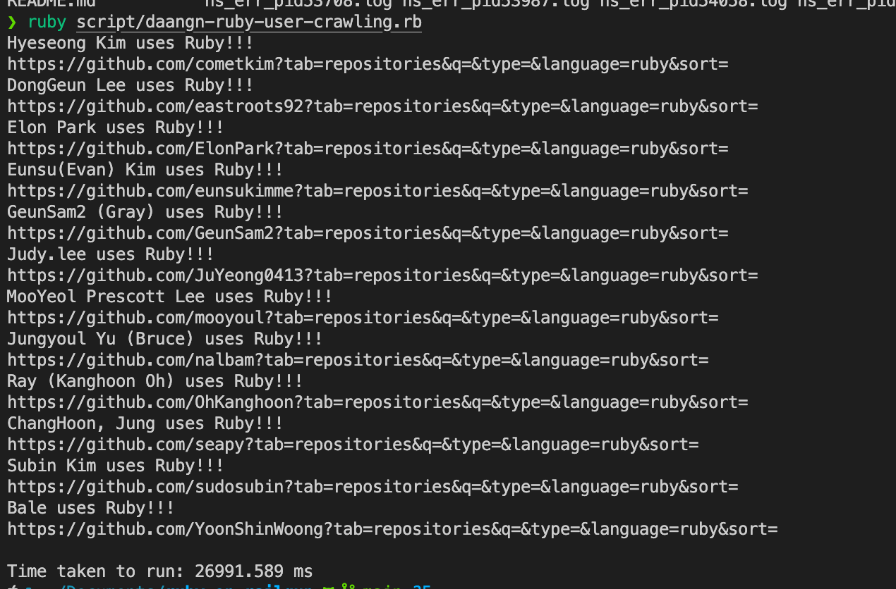
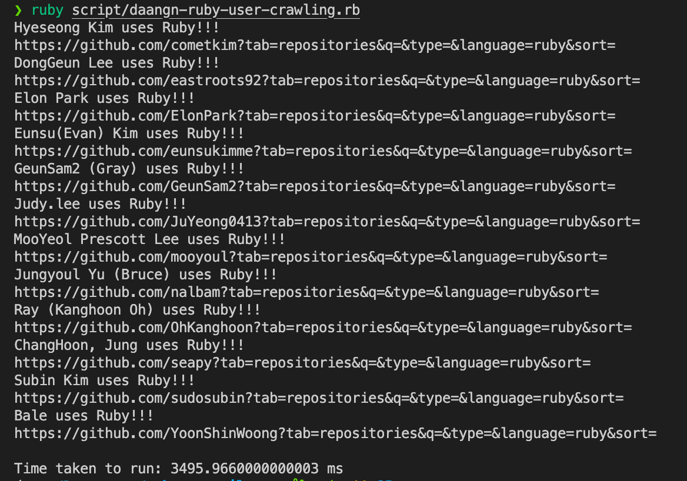

## About

당근은 Ruby를 사용하는 회사 중 가장 유명한 회사입니다.
악의적인 목적으로 만들어진 것이 아닌,
Ruby를 공부하기에 앞서 당근팀의 코드 작성 스타일을 알기 위해서 작성된 스크립트 입니다.

## Installation

- ruby version 

```bash 
❯ ruby -v
ruby 3.2.2 (2023-03-30 revision e51014f9c0) [arm64-darwin24]
❯ gem install concurrent-ruby
```

## Performance

- 동기처리시 26초 걸림



- 비동기처리시 3초까지 단축


