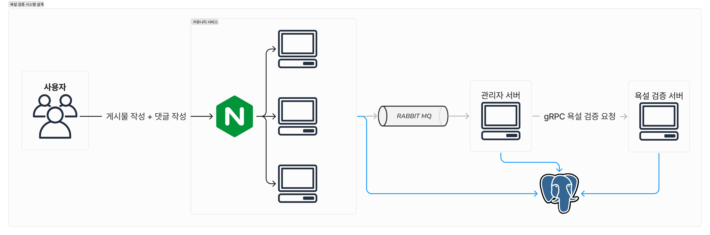

## Blog Posting

- 이슈를 해결한 과정, 성능 테스트, 구현하는데 필요했던 지식 등에 대해서 최대한 상세하게 포스팅 하였습니다.
- https://velog.io/@rookedsysc/series/RoR-%EC%9A%95%EC%84%A4%ED%83%90%EC%A7%80-%EC%8B%9C%EC%8A%A4%ED%85%9C

## Introduction

이 프로젝트는 면접 진행 중에 면접보는 회사에서 사용하는 기술 스택을 사용해보기 위해서 구현 되었습니다.
운영 개발 업무 중 실시간 서비스에서 욕설은 어떻게 필터링이 될까? (ex: 네이버 클린봇) 이라는 궁금증에서 출발 했습니다. 처음에 두 가지 방식으로 구현하는 것을 생각 했습니다.

1. 게시물 작성시 Cache + Positive Response를 통해서 게시물을 작성한 유저에겐 글이 작성된 것처럼 보여주고 백엔드에서는 동기로 처리하는 방식
2. 게시물 작성시 Queue에 넣어두고 최대한 빠르게 is_visible을 false로 처리해서 사용자에게 보여주지 않는 방식

그리고 첫 번째 면접 진행에서 2번째 방식을 사용한다는 답변을 받았고 그래서 프로젝트를 이렇게 설계하게 되었습니다.

- 프로젝트 설계
  - 커뮤니티 서버 : 사용자가 게시물과 댓글을 작성함
    - 관리자 서버와 RabbitMQ를 통해서 연결되어 있음
  - 관리자 서버 : 금지어를 관리하고 외부 API 또는 다른 팀의 AI를 통해서 욕설을 탐지
    - 커뮤니티 서버와 RabbitMQ로 연결되있고 욕설 탐지 서버와 gRPC로 연결되어 있음
  - 욕설 탐지 서버 : PostgreSQL의 Trigram Extension을 통해서 간략하게(아님) 구현된 욕설 탐지 서버
    - 관리자 서버와 gRPC로 연결되어 있음



### gRPC?

gRPC 통신을 사용한 이유는 다음과 같습니다.

1. gRPC를 사용해보고 싶었습니다.
2. 욕설 검증 서버에서 커뮤니티 서버의 데이터베이스에 대한 접근 권한이 없는 상황일 수 있습니다.
3. 욕설 검증 서버 자체로도 이미 부하가 충분히 높을 텐데 **게시물 블라인드 처리**라는 또 다른 부하를 주고 싶지 않았습니다.

- 또한 **욕설 검증**이라는 역할에도 맞지 않는 것 같습니다.

4. 욕설 검증 서버에서 검증 후 다시 관리자 서버로 RPC 요청을 보내는 방식이 있을 수 있으나, 만약 이 RPC 요청이 실패할 경우 재시도 로직을 처리하기가 어렵습니다.

양쪽의 처리량 차이로 인해서 관리자 서버에서 에러가 발생할 경우 **nack**를 보내서 queue에 다시 넣어주는 방식으로 누락을 방지하였습니다.

## Installation

```console
docker compose up -d --build
# 초기 욕설 데이터 세팅
k6 run bad-words/post-to-trigram.js
# 부하 테스트
k6 run k6/post-upload.js
```
