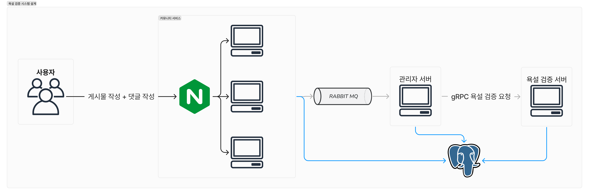
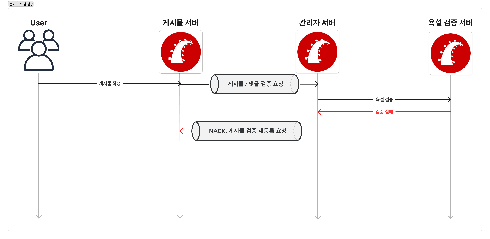
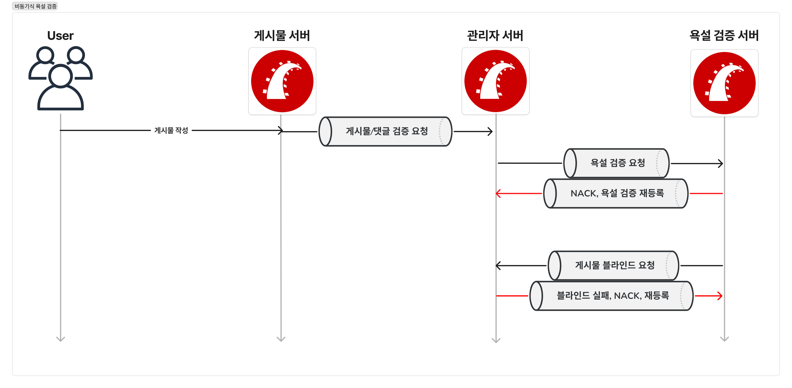

## Overview

Ruby On Rails를 공부해보기 위해서 진행한 프로젝트.
운영 개발 팀에서 클린 봇을 만들 때 인프라를 어떻게 설계할지 고민하며 구현.

- 커뮤니티 서버, 관리자 서버, 욕설 탐지 3개의 서버로 나누는 것으로 설계
  - 커뮤니티 서버와 관리자 서버는 RabbitMQ를 통해서 신규 게시물이 작성되었다고 알림
  - 관리자 서버는 욕설 탐지 서버의 gRPC를 호출해서 욕설 검증을 요청
- PostgreSQL의 trigram index extension을 활용한 욕설 탐지 구현 (블로그 포스팅)
- RabbitMQ의 nack 응답을 활용해서 gRPC 요청으로 욕설 탐지에 실패했을 경우 retry 하도록 구현 

## Portolio

### 욕설 처리 로직 구현

처음에 두 가지 방식으로 구현하는 것을 생각 했습니다.

1. 게시물 작성시 Cache + Positive Response를 통해서 게시물을 작성한 유저에겐 글이 작성된 것처럼 보여주고 백엔드에서는 동기로 처리하는 방식
2. 게시물 작성시 Queue에 넣어두고 최대한 빠르게 is_visible을 false로 처리해서 사용자에게 보여주지 않는 방식

그리고 주변 지인의 회사에서 2번째 방식을 사용한다는 답변을 받았고 그래서 프로젝트를 이와 같이 설계하게 되었습니다.

- 프로젝트 설계
  - 커뮤니티 서버 : 사용자가 게시물과 댓글을 작성함
    - 관리자 서버와 RabbitMQ를 통해서 연결되어 있음
  - 관리자 서버 : 금지어를 관리하고 외부 API 또는 다른 팀의 AI를 통해서 욕설을 탐지
    - 커뮤니티 서버와 RabbitMQ로 연결되있고 욕설 탐지 서버와 gRPC로 연결되어 있음
  - 욕설 탐지 서버 : PostgreSQL의 Trigram Extension을 통해서 간략하게(아님) 구현된 욕설 탐지 서버
    - 관리자 서버와 gRPC로 연결되어 있음



### gRPC?

gRPC 통신을 사용한 이유는 다음과 같습니다.

1. gRPC를 사용해보고 싶었습니다.
2. 욕설 검증 서버에서 커뮤니티 서버의 데이터베이스에 대한 접근 권한이 없는 상황일 수 있습니다.
3. 욕설 검증 서버 자체로도 이미 부하가 충분히 높을 텐데 **게시물 블라인드 처리**라는 또 다른 부하를 주고 싶지 않았습니다.

- 또한 **욕설 검증**이라는 역할에도 맞지 않는 것 같습니다.

4. 양쪽의 처리량 차이로 인해서 관리자 서버에서 에러가 발생할 경우 **nack**를 보내서 queue에 다시 넣어주는 방식으로 누락을 방지하였습니다.
5. 욕설 검증 서버에서 검증 후 다시 관리자 서버로 Blind 요청을 Message로 보내는 방식도 있지만, 구현이 간편하고 Message Queue에 부담을 덜 주는 방식이라는 장점이 있었습니다.

- 동기식 (gRPC) 욕설 처리 실패시 절차



- 비동기식 (Message Queue) 욕설 처리 실패시 절차




## How To Start

```console
docker compose up -d --build
# 초기 욕설 데이터 세팅
k6 run bad-words/post-to-trigram.js
# 부하 테스트
k6 run k6/post-upload.js
```
